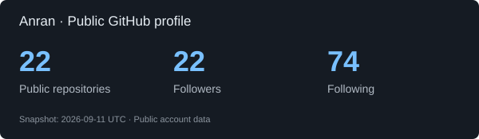

### Hi there 👋

I'm **Anran**! 😎

I like building inference engines, developer tools, and apps that make everyday work a little easier. 🛠️

📃 Some technologies I work with:
  

⭐ Here are some of my projects:

- [nano-vllm-rs](https://github.com/AnranS/nano-vllm-rs) — Qwen3 inference in Rust + CUDA, on a single GPU.
- [Godot Mini Game](https://github.com/AnranS/godot_for_minigame) — export Godot games to WeChat and Douyin; TikTok Native in beta.
- [wasm-split](https://github.com/AnranS/wasm-split-tool) — split large WebAssembly modules and load code on demand.
- [DesktopPulse](https://github.com/AnranS/DesktopPulse) — native macOS widgets for system health, weather, and AI-tool usage.
- [TikTok Mini Game Unity Demo](https://github.com/AnranS/tiktok-minigame-unity-demo) — SDK examples across 14 API categories.
- [Inline Vocabulary Translator](https://github.com/AnranS/inline-vocab-translator) — translate while reading and sync vocabulary across devices.

🏆 GitHub stats

 

🐍 Contribution activity

 
<picture>
  <source media="(prefers-color-scheme: dark)" srcset="https://raw.githubusercontent.com/AnranS/AnranS/output/github-contribution-grid-snake-dark.svg" />
  
</picture>

🔬 Inference experiments

I'm working on **nano-vllm-rs**, a Rust + CUDA inference engine whose inference process runs without Python, PyTorch, or libtorch.

- [Build and run](https://github.com/AnranS/nano-vllm-rs#本机快速开始)
- [Attention validation](https://github.com/AnranS/nano-vllm-rs/blob/main/ATTENTION.md)
- [Stress tests and reproducible results](https://github.com/AnranS/nano-vllm-rs/blob/main/STRESS_TEST.md)

Current validation targets Qwen3-0.6B. FlashAttention is optional and experimental; known chunked-output differences are documented in the validation report.

📚 Project docs and guides

- [Godot Mini Game documentation](https://anrans.github.io/godot_for_minigame/)
- [Godot Mini Game releases](https://github.com/AnranS/godot_for_minigame/releases)
- [How wasm-split works](https://github.com/AnranS/wasm-split-tool#how-it-works)
- [wasm-split performance](https://github.com/AnranS/wasm-split-tool#performance)
- [DesktopPulse setup](https://github.com/AnranS/DesktopPulse#运行)

 

Have an idea or feedback? Feel free to open an issue in the relevant project. 😋

