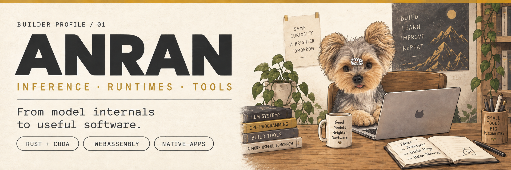

  

  
  
  

  
  

---

## 👋 About Me

I'm **Anran**, building **inference systems, runtimes, and developer tools**. My projects span Rust + CUDA inference, WebAssembly tooling, game-engine integrations, and native macOS apps.

I like opening up the layers between a model and the machine—and turning what I learn into small implementations, interactive guides, and practical tools.

> Understand the internals. Make the behavior visible. Build something useful.

  <code>LLM Inference</code> · <code>Rust &amp; CUDA</code> · <code>WebAssembly</code> · <code>Game Tooling</code> · <code>Native Apps</code>

  <a href="#now-building">Now building</a> ·
  <a href="#selected-work">Selected work</a> ·
  <a href="#open-source-contributions">Contributions</a> ·
  <a href="#project-index">Project index</a>

---

## 🚀 Now Building & Learning

| Track | Projects & direction |
|---|---|
| **Inference engineering** | **[nano-vllm-rs](https://github.com/AnranS/nano-vllm-rs)** — single-GPU Qwen3 inference in Rust + CUDA, with attention validation and reproducible benchmarks. |
| **Inference education** | **[sglang-interactive-guide](https://github.com/AnranS/sglang-interactive-guide)** — 13 Chinese chapters, browser experiments, source links, and exercises. Learn offline, without a GPU. |
| **Game-engine tooling** | **[godot_for_minigame](https://github.com/AnranS/godot_for_minigame)** · **[tiktok-minigame-unity-demo](https://github.com/AnranS/tiktok-minigame-unity-demo)** — exports, platform SDK integration, and working API examples. |
| **Runtimes & delivery** | **[wasm-split-tool](https://github.com/AnranS/wasm-split-tool)** — split large WebAssembly modules and load code on demand. |
| **Everyday tools** | **[DesktopPulse](https://github.com/AnranS/DesktopPulse)** · **[inline-vocab-translator](https://github.com/AnranS/inline-vocab-translator)** — desktop widgets and tools for reading across languages. |

---

## ✦ Selected Work

| Project | Focus | What it does |
|---|---|---|
| **[nano-vllm-rs](https://github.com/AnranS/nano-vllm-rs)** | `Rust` `CUDA` | Qwen3 inference on a single GPU. The inference process runs without Python, PyTorch, or libtorch; FlashAttention is optional and experimental. |
| **[SGLang Interactive Guide](https://github.com/AnranS/sglang-interactive-guide)** | `LLM Inference` `Learning` | An offline learning path through scheduling, KV Cache, RadixAttention, speculative decoding, and serving. |
| **[Godot Mini Game](https://github.com/AnranS/godot_for_minigame)** | `Godot` `SDK Integration` | Export Godot 4 games to WeChat and Douyin Mini Games, with TikTok Native in beta. |
| **[wasm-split-tool](https://github.com/AnranS/wasm-split-tool)** | `Rust` `WebAssembly` | Split a module into an eager primary and a lazy secondary that share memory, tables, and globals. |
| **[DesktopPulse](https://github.com/AnranS/DesktopPulse)** | `SwiftUI` `WidgetKit` | Native macOS widgets for system health, weather, and AI-tool usage. |
| **[Inline Vocabulary Translator](https://github.com/AnranS/inline-vocab-translator)** | `JavaScript` `Browser Tools` | Translate Chinese → English while reading, highlight unfamiliar vocabulary, and sync across devices. |

### 🔬 Inside the inference work

**nano-vllm-rs** connects implementation to evidence:

- [Attention validation](https://github.com/AnranS/nano-vllm-rs/blob/main/ATTENTION.md)
- [Stress tests and reproducible results](https://github.com/AnranS/nano-vllm-rs/blob/main/STRESS_TEST.md)
- [Build, run, and inspect the implementation](https://github.com/AnranS/nano-vllm-rs)

Validation currently targets Qwen3-0.6B. Known chunked-output differences are documented in the validation report.

**SGLang Interactive Guide** pairs explanations with browser experiments. The simulations teach mechanisms; they are not GPU benchmarks.

---

## 🤝 Open-source Contributions

Selected merged contributions to **[deepcoldy/botmux](https://github.com/deepcoldy/botmux)**, a bridge between IM platforms and AI coding CLIs:

| Contribution | Merged work |
|---|---|
| **Codex integration** | [PR #157](https://github.com/deepcoldy/botmux/pull/157) — support goal passthrough. |
| **Resource efficiency** | [PR #153](https://github.com/deepcoldy/botmux/pull/153) — reduce memory leaks, redundant disk writes, and idle screenshot overhead. |
| **Remote configuration** | [PR #132](https://github.com/deepcoldy/botmux/pull/132) — add `/botconfig` with owner-only configuration cards. |

---

## 🛠 Tech Toolbox

**Languages**

**Inference & runtimes**

**Apps & game tooling**

---

## 🗂 Project Index

### Inference & learning

| Project | Role | Description |
|---|---|---|
| [nano-vllm-rs](https://github.com/AnranS/nano-vllm-rs) | Implementation | Rust + CUDA inference engine and validation reports. |
| [sglang-interactive-guide](https://github.com/AnranS/sglang-interactive-guide) | Learning guide | 13 interactive chapters on inference serving. |
| [leetcode](https://github.com/AnranS/leetcode) | Practice | Python and Rust algorithm solutions. |

### Game platforms & developer tools

| Project | Stack | Description |
|---|---|---|
| [godot_for_minigame](https://github.com/AnranS/godot_for_minigame) | Godot · JavaScript | Mini Game export tooling and platform integration. |
| [tiktok-minigame-unity-demo](https://github.com/AnranS/tiktok-minigame-unity-demo) | Unity · C# | Reference examples across 14 SDK API categories, with bilingual documentation. |
| [wasm-split-tool](https://github.com/AnranS/wasm-split-tool) | Rust · WebAssembly | On-demand loading for split WebAssembly modules. |

### Native apps & reading tools

| Project | Stack | Description |
|---|---|---|
| [DesktopPulse](https://github.com/AnranS/DesktopPulse) | Swift · WidgetKit | System, weather, and AI-tool usage widgets for macOS. |
| [inline-vocab-translator](https://github.com/AnranS/inline-vocab-translator) | JavaScript | Inline translation and vocabulary learning. |
| [wallpaper](https://github.com/AnranS/wallpaper) | TypeScript | macOS wallpaper project. |

📚 Learning forks & earlier experiments

These repositories are forks or practice projects, listed separately from the work above.

**Inference & ML learning forks**

- [nano-vllm](https://github.com/AnranS/nano-vllm) · [mini-sglang](https://github.com/AnranS/mini-sglang) · [tiny-llm](https://github.com/AnranS/tiny-llm)
- [minimind](https://github.com/AnranS/minimind) · [pytorch-deep-learning](https://github.com/AnranS/pytorch-deep-learning)

**Runtime & tooling forks**

- [botmux](https://github.com/AnranS/botmux) · [claude-code](https://github.com/AnranS/claude-code)
- [rust](https://github.com/AnranS/rust) · [deno](https://github.com/AnranS/deno) · [node](https://github.com/AnranS/node) · [cocos-engine](https://github.com/AnranS/cocos-engine)

**Personal configuration & practice**

- [nvim](https://github.com/AnranS/nvim) · [leetcode_solutions](https://github.com/AnranS/leetcode_solutions)

📖 Documentation & releases

- [Godot Mini Game documentation](https://anrans.github.io/godot_for_minigame/)
- [Godot Mini Game releases](https://github.com/AnranS/godot_for_minigame/releases)
- [wasm-split: how it works](https://github.com/AnranS/wasm-split-tool#how-it-works)
- [wasm-split: performance](https://github.com/AnranS/wasm-split-tool#performance)
- [DesktopPulse setup](https://github.com/AnranS/DesktopPulse#运行)
- [SGLang guide: offline entry and source](https://github.com/AnranS/sglang-interactive-guide)

🏆 GitHub statistics & contribution activity

 

  
<picture>
  <source media="(prefers-color-scheme: dark)" srcset="https://raw.githubusercontent.com/AnranS/AnranS/output/github-contribution-grid-snake-dark.svg" />
  
</picture>

---

## 📫 Connect

Have a question, an edge case, or an idea for a tool? Open an issue in the relevant project—reproducible examples are always useful.

Learning through implementation, sharing through working software.
