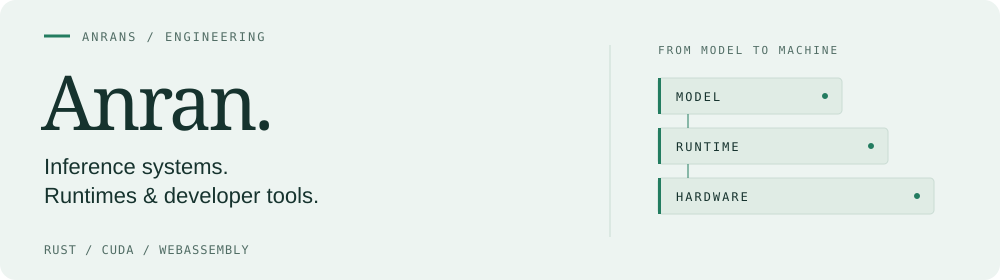

<picture>
  <source media="(prefers-color-scheme: dark) and (max-width: 600px)" srcset="./assets/engineering-header-mobile-dark.svg" />
  <source media="(prefers-color-scheme: light) and (max-width: 600px)" srcset="./assets/engineering-header-mobile-light.svg" />
  <source media="(prefers-color-scheme: dark)" srcset="./assets/engineering-header-dark.svg" />
  
</picture>

  <a href="#featured-work">Featured work</a> &nbsp; / &nbsp;
  <a href="#across-the-stack">Across the stack</a> &nbsp; / &nbsp;
  <a href="#built-with">Built with</a>

I build software close to the runtime: **LLM inference, WebAssembly tooling, game-engine integrations, and native macOS apps.** I care about correctness you can check, experiments you can reproduce, and tools you can use.

## Featured work

<table>
<tr><td>
01 &nbsp; / &nbsp; INFERENCE SYSTEMS
<h2><a href="https://github.com/AnranS/nano-vllm-rs">nano-vllm-rs ↗</a></h2>

<strong>Qwen3 inference. Rust + CUDA. One GPU.</strong>

A native inference engine with paged attention and an optional FlashAttention backend. The inference process runs without Python, PyTorch, or libtorch.

<code>Rust</code> <code>CUDA</code> <code>Qwen3</code> <code>BF16</code>

<a href="https://github.com/AnranS/nano-vllm-rs#本机快速开始"><strong>Build &amp; run →</strong></a> &nbsp; · &nbsp; <a href="https://github.com/AnranS/nano-vllm-rs/blob/main/ATTENTION.md">Attention validation</a> &nbsp; · &nbsp; <a href="https://github.com/AnranS/nano-vllm-rs/blob/main/STRESS_TEST.md">Stress tests</a>

Validated on Qwen3-0.6B. FlashAttention is experimental; known chunked-output differences are documented in the validation report.

</td></tr>
</table>

## Across the stack

<table>
<tr>
<td width="50%" valign="top">
02 &nbsp; / &nbsp; ENGINE TOOLING
<h3><a href="https://github.com/AnranS/godot_for_minigame">Godot Mini Game ↗</a></h3>

Bring Godot games to WeChat and Douyin Mini Games, with TikTok Native in beta. Engine bundles, platform SDKs, and validated exports in one editor workflow.

<code>Godot</code> <code>GDScript</code> <code>WASM</code>

<a href="https://anrans.github.io/godot_for_minigame/">Documentation</a> · <a href="https://github.com/AnranS/godot_for_minigame/releases">Releases</a>

</td>
<td width="50%" valign="top">
03 &nbsp; / &nbsp; RUNTIME ENGINEERING
<h3><a href="https://github.com/AnranS/wasm-split-tool">wasm-split ↗</a></h3>

Load large WebAssembly modules in stages. Profile-guided hot/cold splitting pairs a Rust CLI with a TypeScript runtime for code loaded on demand.

<code>Rust</code> <code>WebAssembly</code> <code>TypeScript</code>

<a href="https://github.com/AnranS/wasm-split-tool#how-it-works">Architecture</a> · <a href="https://github.com/AnranS/wasm-split-tool#performance">Performance</a>

</td>
</tr>
<tr>
<td width="50%" valign="top">
04 &nbsp; / &nbsp; NATIVE APPS
<h3><a href="https://github.com/AnranS/DesktopPulse">DesktopPulse ↗</a></h3>

System health, weather, and AI-tool usage on the macOS desktop. Native WidgetKit widgets powered by a local menu-bar app, with glass and cyberpunk appearances.

<code>Swift</code> <code>SwiftUI</code> <code>WidgetKit</code>

<a href="https://github.com/AnranS/DesktopPulse#运行">Build &amp; setup</a>

</td>
<td width="50%" valign="top">
05 &nbsp; / &nbsp; EVERYDAY TOOLS
<h3><a href="https://github.com/AnranS/inline-vocab-translator">Inline Vocabulary ↗</a></h3>

Chinese-to-English translation where you read. Select text, highlight vocabulary you are learning, and sync across devices through GitHub Gist or Google Drive.

<code>JavaScript</code> <code>Browser tooling</code>

<a href="https://github.com/AnranS/inline-vocab-translator">Explore the project</a>

</td>
</tr>
</table>

**Also built:** [TikTok Mini Game Unity Demo](https://github.com/AnranS/tiktok-minigame-unity-demo) — SDK integration examples across 14 API categories, with bilingual documentation.

## Built with

<picture>
  <source media="(prefers-color-scheme: dark)" srcset="https://skillicons.dev/icons?i=rust%2Cpython%2Ccpp%2Cwasm%2Cts%2Cswift%2Cgodot%2Cgit&amp;theme=dark&amp;perline=8" />
  
</picture>

 

Explore the code, run an experiment, or open an issue in the relevant repository.
