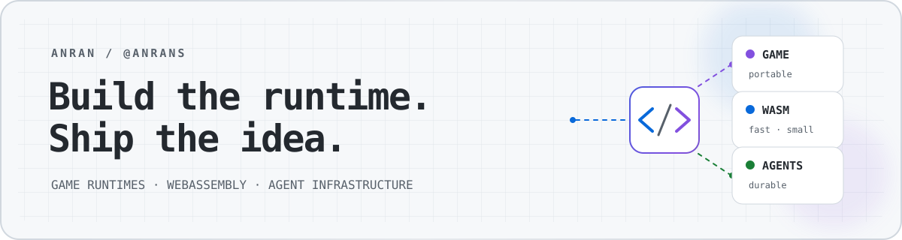

  <picture>
    <source media="(prefers-color-scheme: dark) and (max-width: 600px)" srcset="./assets/profile-header-mobile-dark.svg" />
    <source media="(prefers-color-scheme: light) and (max-width: 600px)" srcset="./assets/profile-header-mobile-light.svg" />
    <source media="(prefers-color-scheme: dark)" srcset="./assets/profile-header-dark.svg" />
    <source media="(prefers-color-scheme: light)" srcset="./assets/profile-header-light.svg" />
    
  </picture>

<h1 align="center">Hi, I'm Anran 👋</h1>

  <strong>I build dependable tools for game runtimes, WebAssembly, and AI-native development.</strong>

  <a href="#selected-work">Selected work</a> ·
  <a href="#toolbox">Toolbox</a> ·
  <a href="#github-at-a-glance">GitHub at a glance</a>

I enjoy the layer where low-level runtime constraints meet real product experience: making engines portable, large binaries load faster, and developer workflows easier to trust. My projects tend to be local-first, testable, and documented for the next person who has to debug them.

- 🎮 Turning game engines into practical mini-game runtimes
- ⚙️ Building systems tools in Rust, TypeScript, Python, and Swift
- 🤖 Exploring durable infrastructure for coding agents
- 🧠 Learning transformer inference from first principles

## Selected work

<table>
  <tr>
    <td width="50%" valign="top">
      <h3><a href="https://github.com/AnranS/godot_for_minigame">Godot Mini Game</a></h3>
      
Export Godot 4 projects to WeChat, Douyin, and TikTok Mini Games through an editor-native, CI-validated WebAssembly toolchain.

      
<code>Godot</code> <code>GDScript</code> <code>WebAssembly</code>

    </td>
    <td width="50%" valign="top">
      <h3><a href="https://github.com/AnranS/wasm-split-tool">wasm-split</a></h3>
      
A profile-guided Rust splitter and TypeScript runtime for loading large WebAssembly modules in hot and cold stages.

      
<code>Rust</code> <code>WebAssembly</code> <code>TypeScript</code>

    </td>
  </tr>
  <tr>
    <td width="50%" valign="top">
      <h3><a href="https://github.com/AnranS/pi_spark">pi-spark</a></h3>
      
A PostgreSQL-backed distributed run engine for durable agent workloads, with leases, fencing, retries, and capability routing.

      
<code>TypeScript</code> <code>PostgreSQL</code> <code>Docker</code>

    </td>
    <td width="50%" valign="top">
      <h3><a href="https://github.com/AnranS/repo-maestro">Repo Maestro</a></h3>
      
A local-first, multi-repo workflow orchestrator that plans dependency-aware changes as auditable DAGs.

      
<code>Rust</code> <code>React</code> <code>Developer Tools</code>

    </td>
  </tr>
  <tr>
    <td width="50%" valign="top">
      <h3><a href="https://github.com/AnranS/DesktopPulse">DesktopPulse</a></h3>
      
A native macOS WidgetKit dashboard for system health, weather, and privacy-conscious AI usage snapshots.

      
<code>Swift</code> <code>SwiftUI</code> <code>WidgetKit</code>

    </td>
    <td width="50%" valign="top">
      <h3><a href="https://github.com/AnranS/inline-vocab-translator">Inline Vocab Translator</a></h3>
      
A Manifest V3 browser extension for instant translation, vocabulary capture, adaptive review, and opt-in sync.

      
<code>JavaScript</code> <code>Chrome Extension</code> <code>Local-first</code>

    </td>
  </tr>
</table>

## Toolbox

  

  Runtime engineering · developer tooling · desktop apps · distributed systems

## GitHub at a glance

  

  
<strong>Languages and contribution trail</strong>

   
  

    
  

  

    <picture>
      <source media="(prefers-color-scheme: dark)" srcset="https://raw.githubusercontent.com/AnranS/AnranS/output/github-contribution-grid-snake-dark.svg" />
      <source media="(prefers-color-scheme: light)" srcset="https://raw.githubusercontent.com/AnranS/AnranS/output/github-contribution-grid-snake.svg" />
      
    </picture>
  

 

  <em>Good tools make hard things feel ordinary.</em>

