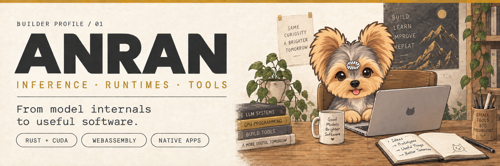
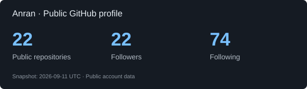

  

  
  
  

  
  

---

## 👋 About Me

I'm **Anran**. I work on **LLM inference and AI infrastructure** — and I learn it the only way that sticks: by writing the thing from scratch, running it, and measuring it.

Most of what I publish is the trail of that process. An inference engine in Rust + CUDA with validation reports. Thirteen handbooks that walk from a tensor to a serving system, where **every code example is executed in CI and its output compared line by line**. Hundreds of exercises you can solve in the browser.

> Read the paper. Write the kernel. Measure it. Then explain it to someone else.

  <code>LLM Inference</code> · <code>CUDA Kernels</code> · <code>PyTorch</code> · <code>Distributed Training</code> · <code>Diffusion</code> · <code>Rust Runtimes</code>

  <a href="#ai-infra-handbooks">AI Infra Handbooks</a> ·
  <a href="#learning-in-public">Learning in public</a> ·
  <a href="#now-building">Now building</a> ·
  <a href="#open-source-contributions">Contributions</a> ·
  <a href="#project-index">Project index</a>

---

## 📚 AI Infra Handbooks — the main thing I'm building

**[ai-infra-handbooks](https://github.com/AnranS/ai-infra-handbooks)** · **[read it →](https://anrans.github.io/ai-infra-handbooks/)** · **[English edition →](https://anrans.github.io/ai-infra-handbooks/en/)**

Thirteen interlinked handbooks that go from "what is a tensor" to "here is a working inference engine", in Chinese and English.

  
  
  
  
  

| | Handbook | What it covers |
|---|---|---|
| 🧠 | **[LLM Internals](https://anrans.github.io/ai-infra-handbooks/llm/)** | Attention, RoPE, KV Cache, quantization, and the arithmetic behind capacity estimates. |
| 🔥 | **[PyTorch in a Hurry](https://anrans.github.io/ai-infra-handbooks/torch/)** | Tensors, shapes, autograd, `nn.Module`, training loops — enough to read everything else. |
| ⚡ | **[Advanced CUDA](https://anrans.github.io/ai-infra-handbooks/cuda/)** | Reductions, GEMM, FlashAttention, Tensor Cores, Triton, Nsight, `torch.compile`. |
| 🌱 | **[Train a Small Model](https://anrans.github.io/ai-infra-handbooks/scratch/)** | Corpus → BPE tokenizer → a small GPT → SFT, LoRA, DPO, distillation, on your own machine. |
| 🧩 | **[Distributed Training](https://anrans.github.io/ai-infra-handbooks/train/)** | DDP, ZeRO/FSDP, tensor / pipeline / expert parallelism, RL training. |
| 🚀 | **[Inference Systems](https://anrans.github.io/ai-infra-handbooks/serving/)** | Continuous batching, paged KV, prefill/decode disaggregation, speculative decoding, serving ops. |
| 🛠 | **[mini-sglang from Scratch](https://anrans.github.io/ai-infra-handbooks/minisgl/)** | Build a complete inference engine chapter by chapter — scheduler, radix cache, CUDA graphs, TP. |
| 🎨 | **[Image & Video Generation](https://anrans.github.io/ai-infra-handbooks/media/)** | Diffusion and flow matching, samplers, and how generative media is actually served. |
| 📜 | **[SGLang Design Evolution](https://anrans.github.io/ai-infra-handbooks/sglang/)** | Reading a real engine's design through its commit history. |

Plus four foundations that the rest leans on: **[Python](https://anrans.github.io/ai-infra-handbooks/python/)** · **[C++](https://anrans.github.io/ai-infra-handbooks/cpp/)** · **[CS Fundamentals](https://anrans.github.io/ai-infra-handbooks/cs/)** · **[Math](https://anrans.github.io/ai-infra-handbooks/math/)**.

**What makes it different from notes:**

- **Every example really runs.** Python, C++ and CUDA samples are executed by CI on each push and their output is compared with the page, line by line — if a number drifts, the build goes red.
- **[288 exercises](https://anrans.github.io/ai-infra-handbooks/practice/)**, graded in your browser (Python on WebAssembly, plus a CUDA simulator) or from the command line on a real GPU.
- **[A learning roadmap](https://anrans.github.io/ai-infra-handbooks/roadmap/)** and **[2060 spaced-repetition flashcards](https://anrans.github.io/ai-infra-handbooks/cards/)** generated from the chapters themselves.
- **Bilingual**, with the English edition built from the same sources so the code can never diverge.

---

## 🧭 The AI stack I'm working through

| Layer | What I'm learning | Where it lives |
|---|---|---|
| **Model internals** | Attention variants, positional encodings, normalization, MoE routing | [LLM Internals](https://anrans.github.io/ai-infra-handbooks/llm/) · [tiny-llm](https://github.com/AnranS/tiny-llm) |
| **Framework** | Autograd, dispatcher, memory allocator, `torch.compile` | [PyTorch in a Hurry](https://anrans.github.io/ai-infra-handbooks/torch/) |
| **Kernels** | Reductions, tiled GEMM, online softmax, FlashAttention, Triton | [Advanced CUDA](https://anrans.github.io/ai-infra-handbooks/cuda/) |
| **Training** | Pretraining a small GPT, SFT, LoRA, DPO, distillation; ZeRO and 3D parallelism | [Train a Small Model](https://anrans.github.io/ai-infra-handbooks/scratch/) · [Distributed Training](https://anrans.github.io/ai-infra-handbooks/train/) |
| **Inference** | Scheduling, paged KV cache, radix prefix reuse, speculative decoding, PD disaggregation | [Inference Systems](https://anrans.github.io/ai-infra-handbooks/serving/) · [nano-vllm-rs](https://github.com/AnranS/nano-vllm-rs) |
| **Engines** | Writing one end to end, then reading how a production engine got there | [mini-sglang](https://anrans.github.io/ai-infra-handbooks/minisgl/) · [SGLang Evolution](https://anrans.github.io/ai-infra-handbooks/sglang/) |
| **Generative media** | Diffusion, flow matching, video pipelines and their serving cost | [Image & Video Generation](https://anrans.github.io/ai-infra-handbooks/media/) |

Everything above is verified on real hardware where it needs to be: the repository ships a [`setup-gpu.sh`](https://github.com/AnranS/ai-infra-handbooks/blob/main/setup-gpu.sh) and a 14-item [`gpu_check.py`](https://github.com/AnranS/ai-infra-handbooks/blob/main/gpu_check.py) self-check that runs the GPU-only examples on an actual card.

---

## 🚀 Now Building

| Track | Projects & direction |
|---|---|
| **AI learning platform** | **[ai-infra-handbooks](https://github.com/AnranS/ai-infra-handbooks)** — 13 bilingual handbooks, 291 chapters, 288 browser-graded exercises, every sample verified in CI. |
| **Inference engineering** | **[nano-vllm-rs](https://github.com/AnranS/nano-vllm-rs)** — single-GPU Qwen3 inference in Rust + CUDA, with attention validation and reproducible benchmarks. No Python, no PyTorch, no libtorch in the inference path. |
| **Inference education** | **[sglang-interactive-guide](https://github.com/AnranS/sglang-interactive-guide)** — 13 Chinese chapters with browser experiments, source links, and exercises. Learn offline, without a GPU. |
| **Runtimes & delivery** | **[wasm-split-tool](https://github.com/AnranS/wasm-split-tool)** — split large WebAssembly modules and load code on demand. |
| **Everyday tools** | **[DesktopPulse](https://github.com/AnranS/DesktopPulse)** · **[inline-vocab-translator](https://github.com/AnranS/inline-vocab-translator)** — desktop widgets and tools for reading across languages. |
| **Game-engine tooling** | **[godot_for_minigame](https://github.com/AnranS/godot_for_minigame)** · **[tiktok-minigame-unity-demo](https://github.com/AnranS/tiktok-minigame-unity-demo)** — exports, platform SDK integration, and working API examples. |

### 🔬 Inside the inference work

**nano-vllm-rs** connects implementation to evidence:

- [Attention validation](https://github.com/AnranS/nano-vllm-rs/blob/main/ATTENTION.md)
- [Stress tests and reproducible results](https://github.com/AnranS/nano-vllm-rs/blob/main/STRESS_TEST.md)
- [Build, run, and inspect the implementation](https://github.com/AnranS/nano-vllm-rs)

Validation currently targets Qwen3-0.6B. Known chunked-output differences are documented in the validation report.

**mini-sglang** (inside the handbooks) goes the other way: 25 chapters that build a working engine — scheduler, radix prefix cache, CUDA graphs, tensor parallelism, an OpenAI-compatible server — with 63 tests that compare its output against Hugging Face token by token.

---

## 🤝 Open-source Contributions

Selected merged contributions to **[deepcoldy/botmux](https://github.com/deepcoldy/botmux)**, a bridge between IM platforms and AI coding CLIs:

| Contribution | Merged work |
|---|---|
| **Codex integration** | [PR #157](https://github.com/deepcoldy/botmux/pull/157) — support goal passthrough. |
| **Resource efficiency** | [PR #153](https://github.com/deepcoldy/botmux/pull/153) — reduce memory leaks, redundant disk writes, and idle screenshot overhead. |
| **Remote configuration** | [PR #132](https://github.com/deepcoldy/botmux/pull/132) — add `/botconfig` with owner-only configuration cards. |

---

## 🛠 Tech Toolbox

**AI & inference**

**Languages**

**Runtimes, apps & tooling**

---

## 🗂 Project Index

### AI, inference & learning

| Project | Role | Description |
|---|---|---|
| [ai-infra-handbooks](https://github.com/AnranS/ai-infra-handbooks) | Learning platform | 13 bilingual handbooks, 291 chapters, 288 graded exercises, CI-verified examples. |
| [nano-vllm-rs](https://github.com/AnranS/nano-vllm-rs) | Implementation | Rust + CUDA inference engine and validation reports. |
| [sglang-interactive-guide](https://github.com/AnranS/sglang-interactive-guide) | Learning guide | 13 interactive chapters on inference serving. |
| [leetcode](https://github.com/AnranS/leetcode) | Practice | Python and Rust algorithm solutions. |

### Game platforms & developer tools

| Project | Stack | Description |
|---|---|---|
| [godot_for_minigame](https://github.com/AnranS/godot_for_minigame) | Godot · JavaScript | Mini Game export tooling and platform integration. |
| [tiktok-minigame-unity-demo](https://github.com/AnranS/tiktok-minigame-unity-demo) | Unity · C# | Reference examples across 14 SDK API categories, with bilingual documentation. |
| [wasm-split-tool](https://github.com/AnranS/wasm-split-tool) | Rust · WebAssembly | On-demand loading for split WebAssembly modules. |

### Native apps & reading tools

| Project | Stack | Description |
|---|---|---|
| [DesktopPulse](https://github.com/AnranS/DesktopPulse) | Swift · WidgetKit | System, weather, and AI-tool usage widgets for macOS. |
| [inline-vocab-translator](https://github.com/AnranS/inline-vocab-translator) | JavaScript | Inline translation and vocabulary learning. |
| [wallpaper](https://github.com/AnranS/wallpaper) | TypeScript | macOS wallpaper project. |

📚 Learning forks & earlier experiments

These repositories are forks or practice projects, listed separately from the work above.

**Inference & ML learning forks**

- [nano-vllm](https://github.com/AnranS/nano-vllm) · [mini-sglang](https://github.com/AnranS/mini-sglang) · [tiny-llm](https://github.com/AnranS/tiny-llm)
- [minimind](https://github.com/AnranS/minimind) · [pytorch-deep-learning](https://github.com/AnranS/pytorch-deep-learning)

**Runtime & tooling forks**

- [botmux](https://github.com/AnranS/botmux) · [claude-code](https://github.com/AnranS/claude-code)
- [rust](https://github.com/AnranS/rust) · [deno](https://github.com/AnranS/deno) · [node](https://github.com/AnranS/node) · [cocos-engine](https://github.com/AnranS/cocos-engine)

**Personal configuration & practice**

- [nvim](https://github.com/AnranS/nvim) · [leetcode_solutions](https://github.com/AnranS/leetcode_solutions)

📖 Documentation & releases

- [AI Infra Handbooks — read online](https://anrans.github.io/ai-infra-handbooks/) · [English edition](https://anrans.github.io/ai-infra-handbooks/en/)
- [AI Infra Handbooks — exercises](https://anrans.github.io/ai-infra-handbooks/practice/) · [roadmap](https://anrans.github.io/ai-infra-handbooks/roadmap/) · [flashcards](https://anrans.github.io/ai-infra-handbooks/cards/)
- [SGLang guide: offline entry and source](https://github.com/AnranS/sglang-interactive-guide)
- [Godot Mini Game documentation](https://anrans.github.io/godot_for_minigame/)
- [Godot Mini Game releases](https://github.com/AnranS/godot_for_minigame/releases)
- [wasm-split: how it works](https://github.com/AnranS/wasm-split-tool#how-it-works)
- [wasm-split: performance](https://github.com/AnranS/wasm-split-tool#performance)
- [DesktopPulse setup](https://github.com/AnranS/DesktopPulse#运行)

🏆 GitHub statistics & contribution activity

 

  
<picture>
  <source media="(prefers-color-scheme: dark)" srcset="https://raw.githubusercontent.com/AnranS/AnranS/output/github-contribution-grid-snake-dark.svg" />
  
</picture>

---

## 📫 Connect

Learning something in the same direction? The handbooks are open — corrections, better explanations and new exercises are all welcome, and every chapter links to the source it came from.

Have a question, an edge case, or an idea for a tool? Open an issue in the relevant project — reproducible examples are always useful.

Learning through implementation, sharing through working software.
